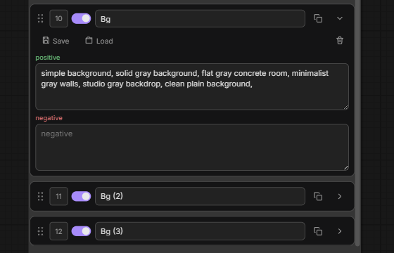

# Changelog

All notable changes to **Prompt Concatenate Pro** are documented here.

Format: newest first.

---

## [1.1.0] — 2026-08-16

### Duplicate pair on the node

You can stack several complementary prompts from the same library shelf without merging them into one field.

- **Copy** button on each group card (after the title, before collapse)
- Creates a new group **directly under the source** (same positive / negative / enabled) — no scrolling the whole stack, no clever insert rules
- Title gets a numeric suffix: `Pose` → `Pose (2)` → `Pose (3)`
- Each copy has its own id and sidebar pin labels (`Pose (2) | positive`), so Favorites stay distinct
- **Save pair** / **Load pair** normalize the title: strip trailing ` (N)` and use the base name as the collection (`Pose (2)` → shelf **Pose**)
- Join order stays under your control via drag / priority; auto-numbering is only the title, not list position
- Existing workflows and library data from 1.0.x are unchanged; plain titles still map 1:1 to shelves

---

## [1.0.0] — 2026-08-14

Initial release:

- Modular prompt groups with join to `str_pos` / `str_neg`
- Sidebar pinning for per-group positive / negative
- Layout presets (stacks) and prompt pairs with SQLite library
- Library manager (rename / move / delete / edit)
